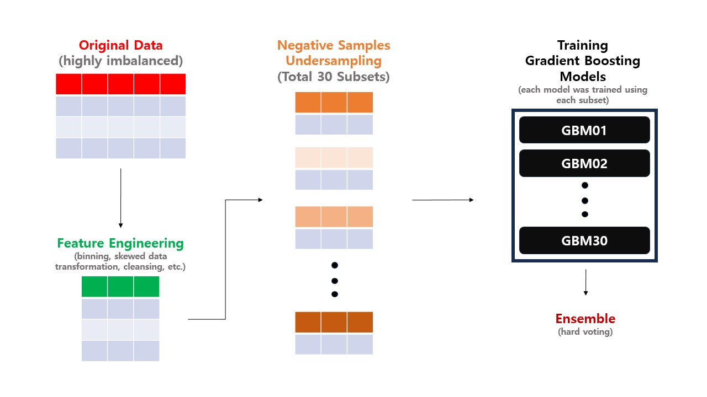

# 24-LG-Aimers-Phase2
### 📢 대회 개요
- **주제**: MQL 데이터 기반 B2B 영업기회 창출 예측 모델 개발
- **기간**: 2024.02.01 ~ 02.26 (약 4주)
- **주최**: LG AI Research
 

### 🔬 최종 전략

- **구현 코드:** [lgaimers_final_code.ipynb](lgaimers_final_code.ipynb)
 

### 🏅 대회 결과
- **Public**: 65 / 884 (상위 7%)
- **Private**: 66 / 884 (상위 7%)
 

### 📝 대회 후기
- [링크](tmp)
